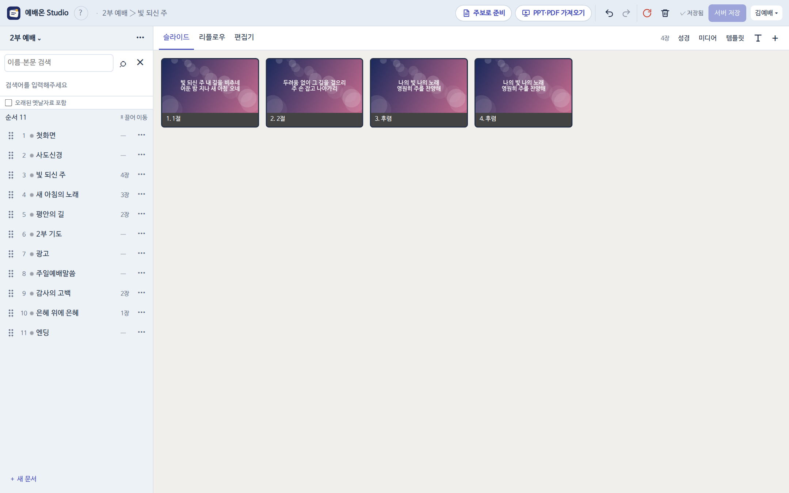

예배온은 교회 ProPresenter 6(PP6) 자료를 **집이나 휴대폰에서도 고칠 수 있게** 만든 도구예요. 세 부분이 함께 움직입니다.

::flow Studio|집·휴대폰 브라우저에서 순서와 슬라이드를 고쳐요 ; 서버|고친 것이 저장되는 곳. 정본이에요 ; Sync 2|교회 Mac에서 서버 것을 받아요 ; ProPresenter|받은 순서·문서로 송출

## 누가 무엇을 하나요

| 하는 사람 | 쓰는 곳 | 하는 일 |
|---|---|---|
| 작업자 | Studio(웹) | 순서 짜기, 가사·말씀 고치기, 주보·PPT 가져오기 |
| 예배 담당 | 교회 Mac Sync 2 | 예배 전에 받기 한 번 |
| 관리자 | Studio·현황판·Sync 정리 창 | 휴지통 비우기, 카테고리, 드롭박스 연결, 문제 정리 |

## 꼭 기억할 두 가지

1. Studio에서 고친 것은 [[!서버 저장]]을 눌러야 교회 Mac으로 갈 수 있어요.
2. 교회 Mac에서는 **ProPresenter를 켜기 전에** Sync 2에서 [[!받기]]를 눌러요.

> [!TIP]
> 처음이라면 [매주 하는 일](#weekly)부터 읽어 보세요. 한 주 흐름이 한 페이지에 있어요.

## 이 설명서 쓰는 법

- 위쪽 검색(<kbd>Ctrl K</kbd>)으로 버튼 이름이나 화면 문구를 찾을 수 있어요.
- 페이지마다 오른쪽 위 [[이 페이지 복사 ▾]]로 내용을 Markdown으로 복사하거나, ChatGPT·Claude에게 이 설명서를 기준으로 물어볼 수 있어요.
- 그림을 누르면 크게 보여요. 그림 속 곡 이름·가사·사람 이름은 설명용 예시예요.
- 관리자 표시가 붙은 페이지는 관리자 비밀번호가 있어야 하는 일이에요.
