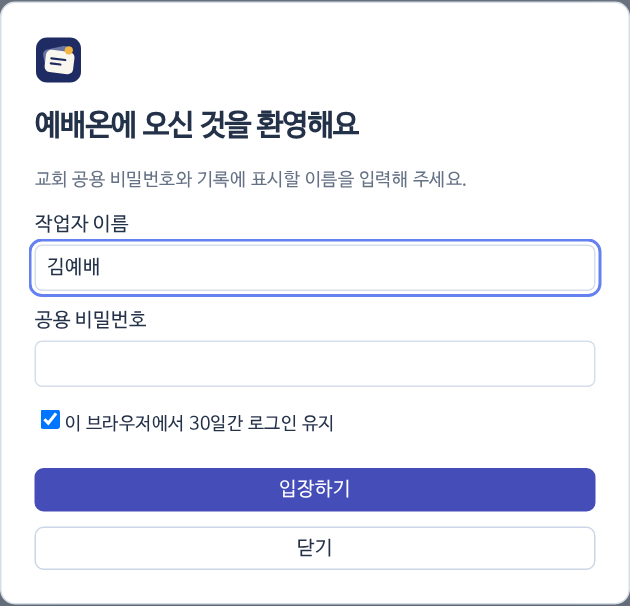

## 입장하기

{small}

1. 사이트 주소를 열면 입장 화면이 나와요.
2. **작업자 이름**과 교회에서 받은 **공용 비밀번호**를 넣고 [[!입장하기]]를 눌러요.
3. 내 컴퓨터라면 `이 브라우저에서 30일간 로그인 유지`를 켜 두세요.
4. 이름은 누가 언제 저장했는지 기록하는 데 쓰여요. 같은 사람은 늘 같은 이름으로 들어와 주세요.

## 화면 구성

| 자리 | 있는 것 |
|---|---|
| 위쪽 줄 | 로고 · [[?]] 설명서 · [[주보로 준비]] · [[PPT·PDF 가져오기]] · 실행취소/다시 실행 · 빨간 ↻ 초기화 · 휴지통 · 저장 상태 · [[!서버 저장]] · 내 이름 |
| 왼쪽 | 재생목록(예배) 고르기 · 이름·본문 검색 · 순서 |
| 가운데 | [[슬라이드]] · [[리플로우]] · [[편집기]] 탭 |
| 가운데 오른쪽 위 | [[성경]] · [[미디어]] · [[템플릿]] · 글상자 T · 새 슬라이드 + |

> [!NOTE]
> 휴대폰에서는 위쪽 버튼이 아이콘만 보이고, 편집기 아래에 슬라이드 띠와 ‹ n / N › 버튼이 생겨요.
