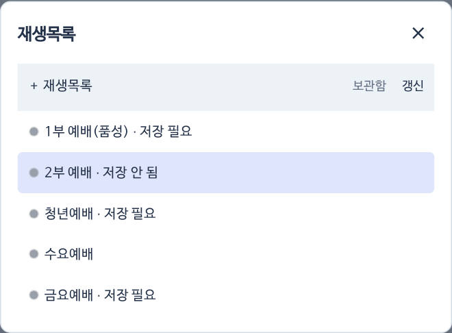
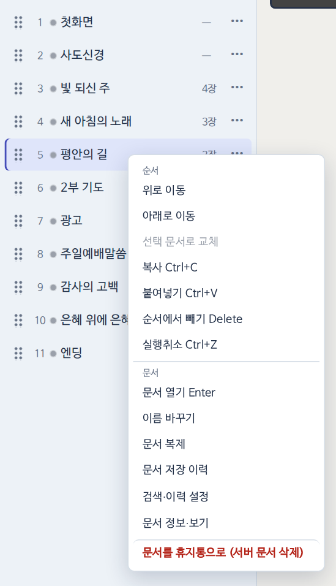

## 재생목록 고르기

왼쪽 맨 위 예배 이름(예: `2부 예배 ⌄`)을 누르면 재생목록 창이 열려요. 여기서 예배를 고르거나 [[+ 재생목록]]으로 새로 만들어요. 저장하지 않은 변경이 있는 예배에는 `· 저장 안 됨`이 붙어요.

{small}

## 문서 찾아 넣기

{small}

1. 검색창(`이름·본문 검색`)에 곡 이름이나 **가사 일부**를 쳐요. 이름이 같은 것 → 이름이 시작하는 것 → 본문만 맞는 것 순서로 나와요.
2. 결과 오른쪽 [[+]]를 누르면 순서 **맨 아래**에 들어가요.
3. 결과 줄을 누르면 넣지 않고 문서만 열어요.
4. 오래된 자료까지 찾으려면 `오래된 옛날자료 포함`을 켜요.

## 순서 바꾸기·빼기

- 왼쪽 손잡이(⠿)를 끌어 원하는 자리에 놓아요.
- 항목을 고르고 <kbd>Delete</kbd>를 누르면 **이 순서에서만** 빠져요. 문서는 서버에 그대로 있어요.
- 항목 오른쪽 클릭(또는 ⋯)으로 메뉴를 열어요.

{small}

| 묶음 | 메뉴 |
|---|---|
| 순서 | 위로·아래로 이동 · 선택 문서로 교체 · 복사 · 붙여넣기 · 순서에서 빼기 · 실행취소 |
| 문서 | 문서 열기 · 이름 바꾸기 · 문서 복제 · 문서 저장 이력 · 검색·이력 설정 · 문서 정보·보기 |
| 빨간 메뉴 | **문서를 휴지통으로 (서버 문서 삭제)** |

> [!WARNING]
> 빨간 메뉴는 서버 문서 자체를 휴지통으로 옮겨요. 다른 예배에서도 그 문서를 쓰고 있을 수 있어요. 순서에서만 빼려면 <kbd>Delete</kbd>를 쓰세요.
