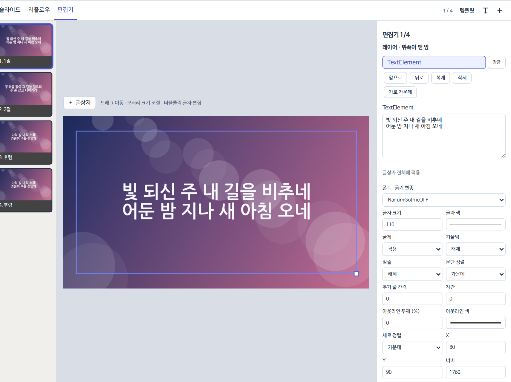
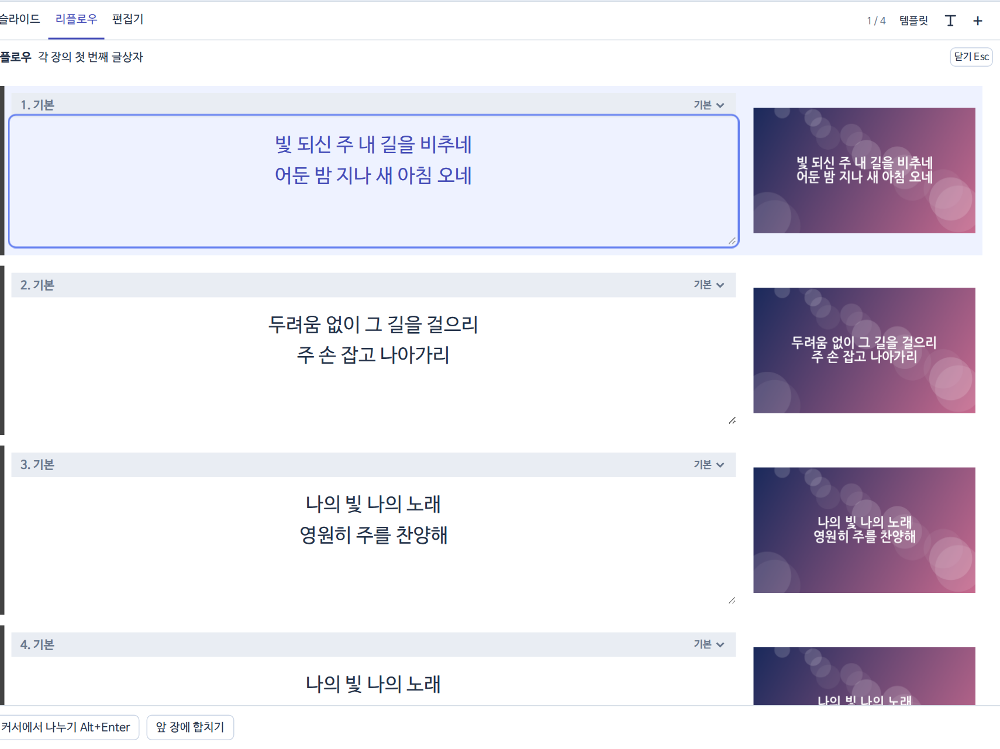
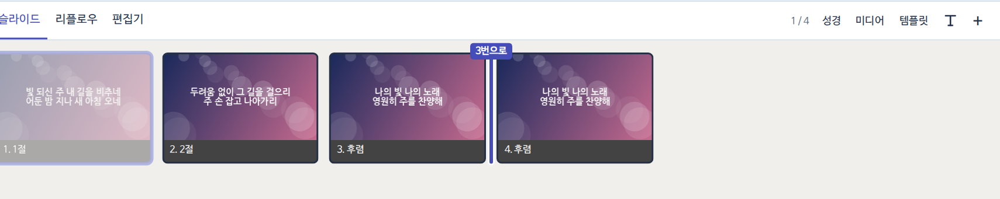

## 세 가지 보기

| 탭 | 단축키 | 쓰는 때 |
|---|---|---|
| 슬라이드 | | 장을 한눈에 보고 순서를 바꿀 때 |
| 리플로우 | <kbd>Alt R</kbd> | 가사를 글로 쭉 보며 줄을 나누고 합칠 때 |
| 편집기 | <kbd>Alt E</kbd> | 글상자 위치·크기·글꼴을 고칠 때 |

## 글 고치기

- 편집기에서 글상자를 **두 번 눌러** 고쳐요. 끌어서 옮기고, 모서리로 크기를 바꿔요.
- 휴대폰에서는 글상자를 한 번 눌러 고른 다음 움직여요.
- 오른쪽 칸에서 글꼴·글자 크기·색·정렬·위치를 숫자로 고칠 수 있어요.
- 리플로우에서 <kbd>Alt Enter</kbd>는 장 나누기, 맨 앞에서 <kbd>Backspace</kbd>는 앞 장과 합치기예요.

## 장 순서·복제

- 슬라이드를 끌면 들어갈 자리에 파란 줄과 `n번으로`가 보여요.
- 마지막 장 뒤 빈 곳에 놓으면 문서 맨 끝으로 가요.
- 장을 고르고 <kbd>Ctrl D</kbd>(Mac <kbd>⌘ D</kbd>)로 복제해요.
- 슬라이드를 오른쪽 클릭하면 빠른 편집·이름 바꾸기·복제·복사·붙여넣기·삭제와 배경 메뉴가 나와요.
- 휴대폰·태블릿은 0.3초 누른 뒤 끌어요. 바로 밀면 화면이 스크롤돼요.
