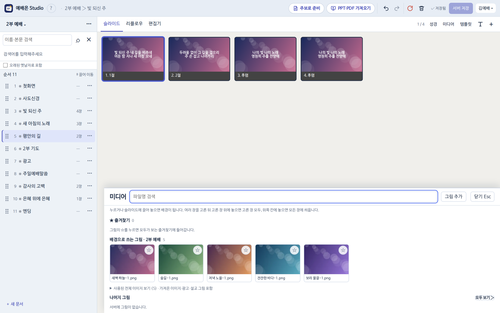
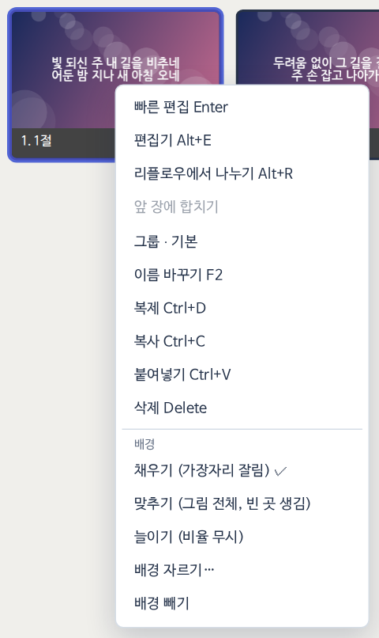
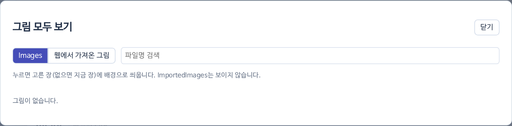
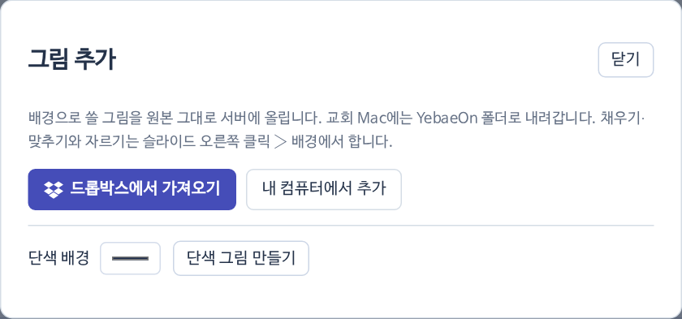
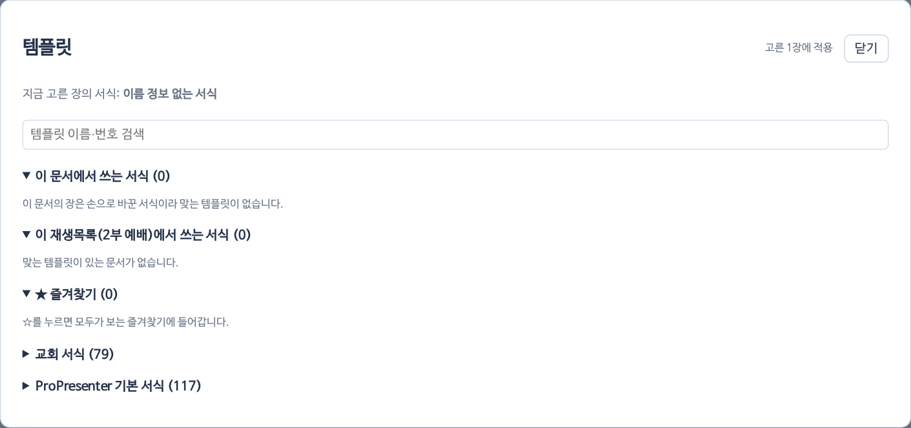

## 미디어 서랍 (<kbd>Alt V</kbd>)

서랍은 위에서부터 이렇게 보여요.

1. **★ 즐겨찾기** — 모두가 함께 보는 즐겨찾기예요. 그림의 ☆를 누르면 들어가요.
2. **배경으로 쓰는 그림** — 지금 재생목록 문서들이 쓰는 배경.
3. **나머지 그림** — 서버 그림 일부와 [[모두 보기 ›]]. 모두 보기에는 `Images`와 `웹에서 가져온 그림`이 있어요.

## 배경 씌우기

- 그림을 **누르면** 고른 장(없으면 지금 장)에 씌워요.
- 고른 장 위에 **끌어 놓으면** 고른 장 모두에 씌워요.
- 끄는 동안 위쪽에 생기는 칸에 놓으면 **모든 장**에 씌워요.
- 슬라이드 오른쪽 클릭 › 배경: **채우기**(가장자리 잘림) · **맞추기**(그림 전체, 빈 곳 생김) · **늘이기**(비율 무시) · 배경 자르기… · 배경 빼기.

{small}

## 그림 추가

서랍 머리줄 [[그림 추가]]에서 내 컴퓨터·드롭박스 그림이나 단색을 올려요. 원본 그대로 서버에 올라가고, 교회 Mac에는 `YebaeOn` 폴더로 내려가요.

{small}

> [!TIP]
> 악보 PPT를 가져올 때 떼어 낸 배경도 `웹에서 가져온 그림`에 자동으로 올라가 있어요.

## 템플릿

편집 도구줄 [[템플릿]]: 지금 장의 서식, 이 문서·이 재생목록에서 쓰는 서식, ★ 공용 즐겨찾기, 교회 서식. 고른 장(없으면 모든 장)에 적용돼요.
