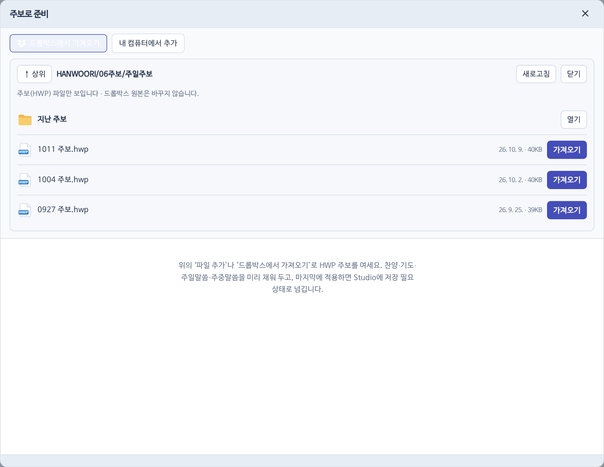
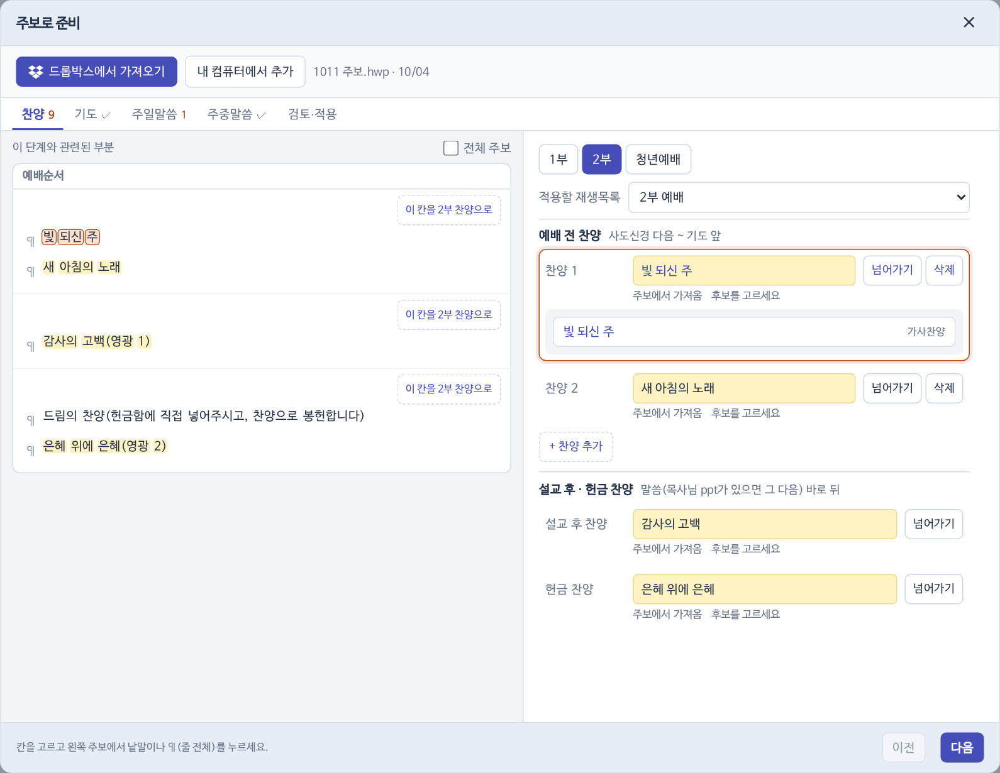
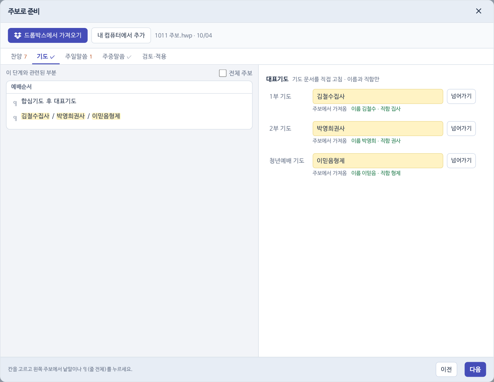
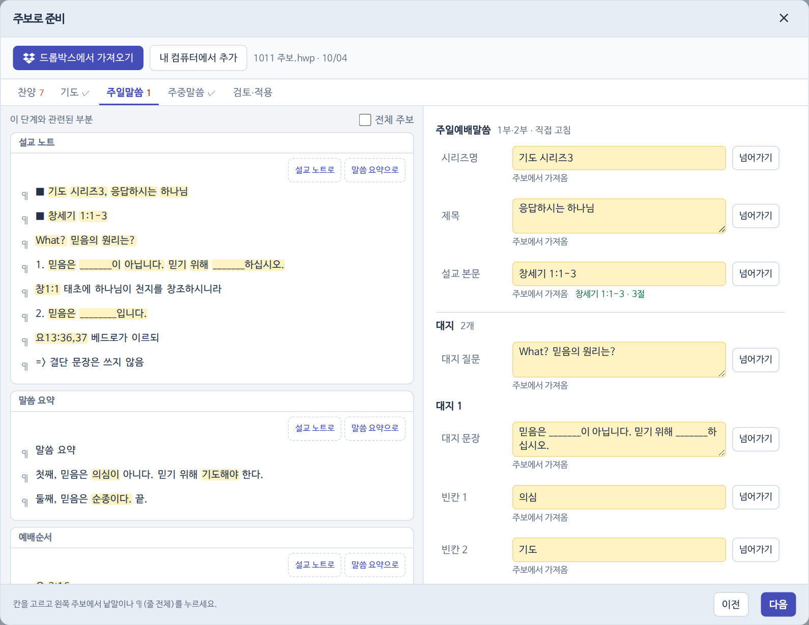
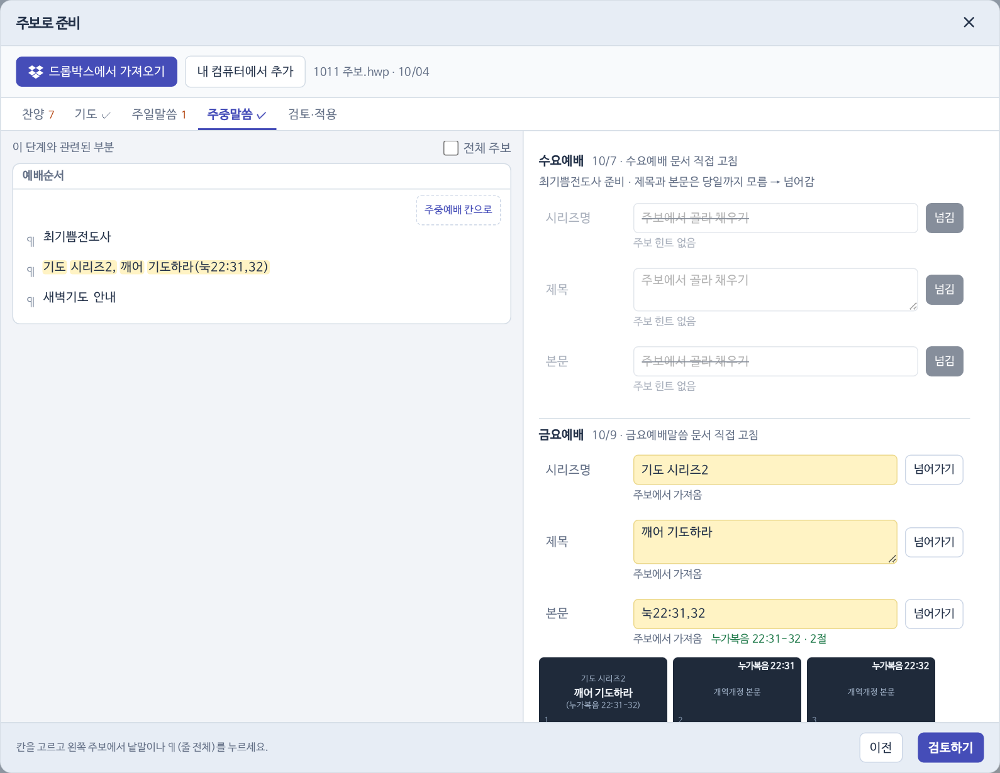
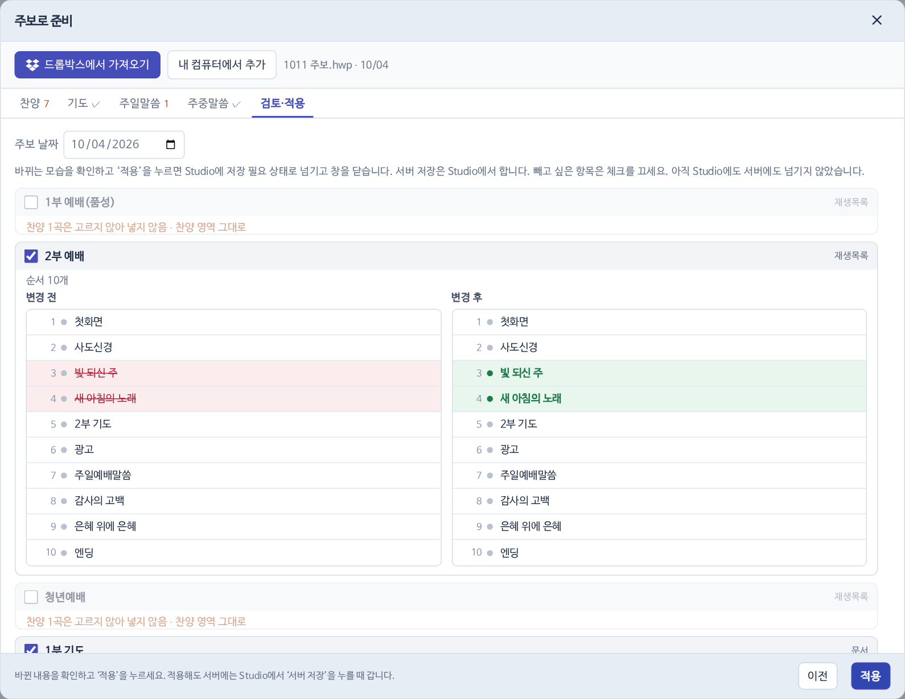
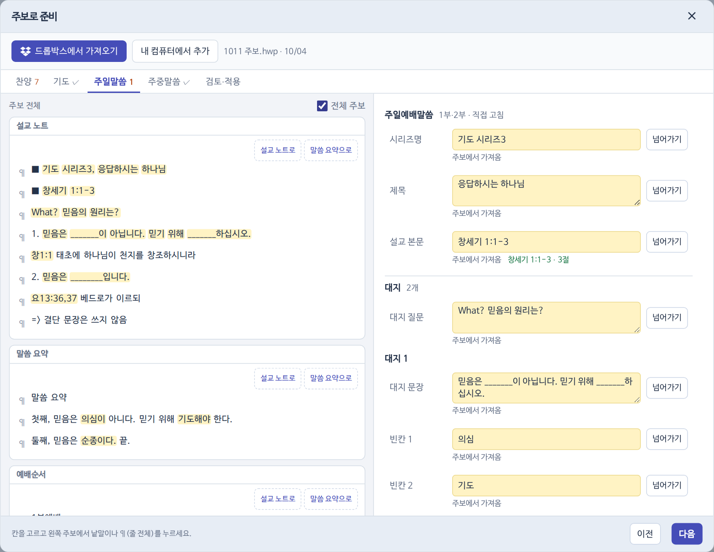

## 순서

::flow 주보 열기|드롭박스나 내 컴퓨터에서 HWP ; 노란 칸 검수|찬양·기도·주일말씀·주중말씀 탭 ; 검토·적용|전·후 비교 미리 보기 ; 서버 저장|위쪽 버튼으로 확정

1. [[주보로 준비]] → [[!드롭박스에서 가져오기]]. 늘 `HANWOORI/06주보/주일주보`에서 열리고 최신 파일이 위에 있어요. 이번 주 주보 옆 [[!가져오기]].

2. 탭마다 노란 칸을 확인해요. 칸을 고르고 왼쪽 주보의 낱말을 누르면 바뀌고, 이어서 누르면 덧붙어요. `¶`는 줄 전체예요.
3. **찬양** 칸은 검색창이에요. 아래 결과에서 쓸 문서(가사·악보)를 눌러요. 자동으로 바꾸지 않아요.

4. [[검토·적용]]에서 바뀌는 순서와 슬라이드를 전·후로 봐요. 재생목록 → 기도자 → 말씀 → 주중예배 순서로 나와요. 빼고 싶은 항목은 체크를 꺼요. 확인했으면 [[!적용]].

5. 바뀐 재생목록에 표시가 붙고, 위쪽 서버 저장 옆에 고친 개수가 보여요. [[!서버 저장]]을 눌러요.

> [!NOTE]
> 적용을 서버 저장과 나눈 것은 한 번 더 맨눈으로 보라는 뜻이에요.

## 양식이 바뀌어 추천이 틀릴 때

- 칸 하나는 언제든 직접 고쳐요. `전체 주보`를 켜면 표 전체에서 고를 수 있어요.

- 주보 칸마다 붙는 단추로 구역을 지정해요: ‘이 칸을 N부 찬양으로’ · ‘설교 노트로’ · ‘말씀 요약으로’ · ‘주중예배 칸으로’.
- 기도는 ‘가 / 나 / 다’ 줄의 `¶`를 누르면 1·2·3부가 한 번에 채워져요.
