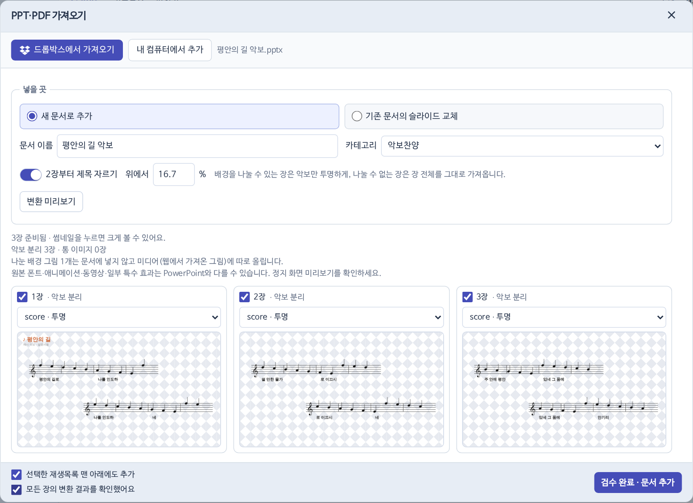
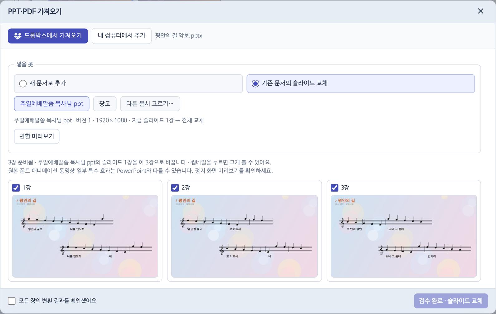

## 어떤 경우에 무엇을

| 경우 | 넣을 곳 | 결과 |
|---|---|---|
| 악보 PPT | 새 문서 · 카테고리 `악보찬양` | 악보만 투명하게. 나눌 수 없는 장은 장 전체 그림 |
| 행사 PPT | 새 문서 · 카테고리 직접 | 장 전체 그림 |
| 광고 PPT | 기존 문서 교체 · `광고` | 장 전체 그림 |
| 설교 PDF | 기존 문서 교체 · `주일예배말씀 목사님 ppt` | 쪽 전체 그림, 비율이 다르면 검은 여백 |

## 악보찬양

1. 파일을 고르고 카테고리 `악보찬양`.
2. `2장부터 제목 자르기`를 켜 두면 첫 장만 제목이 남아요.
3. [[변환 미리보기]] → 장마다 확인 → `모든 장의 변환 결과를 확인했어요` 체크 → [[!검수 완료 · 문서 추가]].

> [!TIP]
> 누르는 순간 문서가 서버에 저장되고, `선택한 재생목록 맨 아래에도 추가`를 켜 두면 순서도 함께 저장돼요. 떼어 낸 배경은 미디어 › 모두 보기 › 웹에서 가져온 그림에 올라가요.

## 기존 문서 교체

넣을 곳을 `기존 문서의 슬라이드 교체`로 바꾸고 후보(`주일예배말씀 목사님 ppt`·`광고`)를 누르거나 [[다른 문서 고르기…]]로 찾아요. 문서의 슬라이드만 통째로 바뀌고 이름·카테고리·사용일은 그대로예요.

## 크기 제한

PPT 40MB·120장, PDF 60MB·120쪽. 원본 파일은 서버에 저장하지 않아요.
