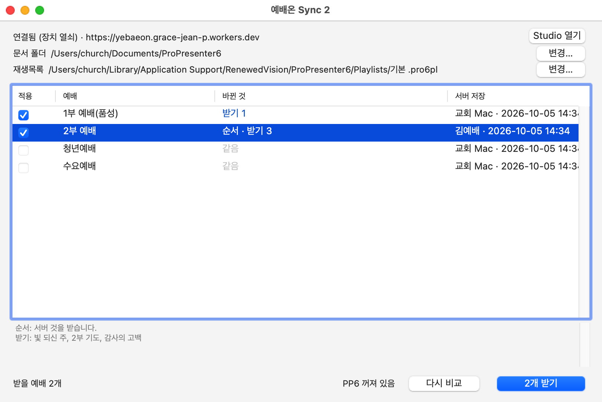
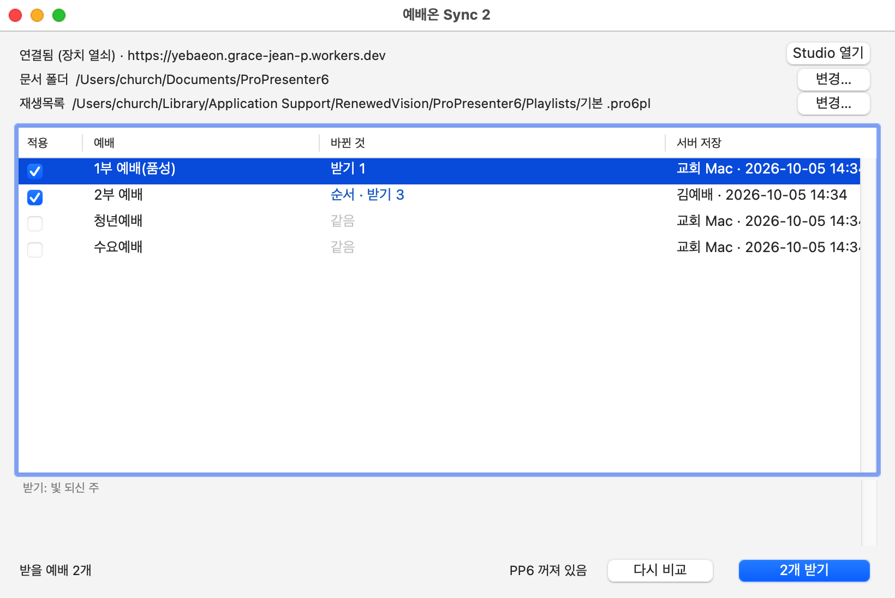

## 매번 하는 일

1. 교회 Mac을 켜면 **예배온 Sync 2**가 저절로 열리고 서버와 비교해요. (켜 있는 동안 15분마다 다시 확인해요.)
2. 표에서 체크된 예배를 확인해요. 줄을 누르면 표 아래에 받을 문서 이름이 나와요.
3. [[!N개 받기]]를 눌러요.
4. ProPresenter를 켜요.

## 표 읽는 법

| 바뀐 것 | 뜻 |
|---|---|
| 같음 | 받을 것 없음 |
| 받기 3 | 서버에서 바뀐 문서 3개를 받아요 |
| 순서 | 예배 순서가 바뀌었어요 |
| 올리기 1 | Mac에서만 고친 문서를 서버로 올려요 |
| 양쪽 수정 | 양쪽에서 고쳤어요. 서버 것을 받고 Mac 것은 서버 보관본·백업에 남겨요 |
| 이력 없음 | 어느 쪽이 맞는지 몰라요. 관리자가 정리 창에서 정해요 |

## 이럴 땐

- 방금 웹에서 고쳤다면 [[다시 비교]]를 먼저 눌러요.
- 아래에 `PP6 실행 중`이 보이면 ProPresenter를 닫아요. 받기는 ProPresenter가 꺼져 있어야 해요.
- 메뉴 막대의 `예배온 최신` / `예배온 대기 n`으로 상태를 볼 수 있어요.

> [!WARNING]
> 이상한 점이 보이면 받지 말고 관리자에게 알려 주세요.
