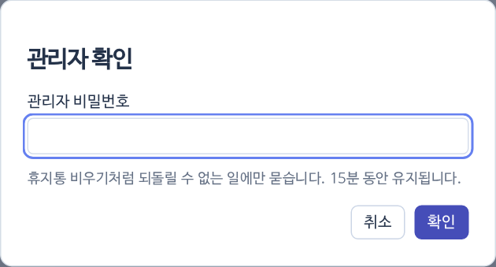

> [!ADMIN]
> 이 묶음의 일은 관리자 비밀번호가 있어야 해요. 비밀번호는 서버 설정의 `ADMIN_PASSWORD`이고, 채팅이나 GitHub에 적지 않아요.

{small}

- 휴지통 비우기, 카테고리 설정, 교회 Mac 원격 명령처럼 되돌리기 어려운 일을 누르면 비밀번호 창이 떠요.
- 맞으면 **하루** 동안 다시 묻지 않아요(같은 입장에서만).
- 작업자 메뉴에서 관리자 일이 들어 있는 항목(교회 Mac, 설정·관리)에는 **관리자** 칩이 붙어 있어요.
- 비밀번호가 설정되지 않았으면 이 일들은 막혀 있어요.
