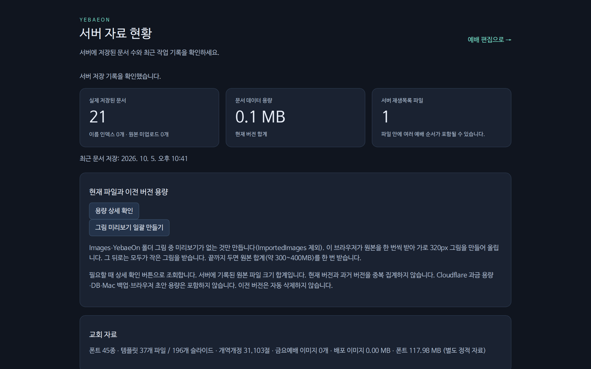

작업자 메뉴 › **서버 현황**(새 탭) 또는 사이트 주소 뒤에 `/status`.

| 칸 | 보는 것 |
|---|---|
| 위쪽 숫자 | 저장된 문서 · 문서 용량 · 이미지 원본 수 · 이미지 용량 |
| Studio 작업 | 작업자마다 최근 저장 시각과 그날 손댄 예배 순서·문서 |
| Sync 기록 | 교회 Mac이 받은 것·올린 것, 원격 명령과 결과(시각순). 제목 옆에 Mac마다 설치된 Sync 빌드와 최신 빌드 설치 여부 |
| 최근 저장된 문서 | 문서마다 저장한 곳([[Studio]] 작업자 또는 [[Mac]] 기기)과 PP6 최근 사용일 |
| 이미지 | [[폴더별 확인]]으로 폴더별 그림 수·용량, [[일괄 만들기]]로 없는 미리보기만 만들어요 |
| 버전별 용량 | [[상세 확인]]으로 현재 문서·재생목록과 이전 버전 용량 |

열 때와 [[새로고침]]을 누를 때만 서버를 읽어요.
